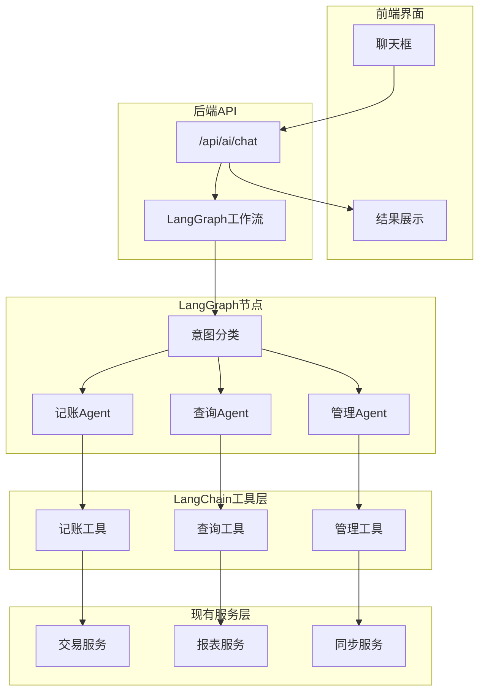

## Beancount Web AI 智能助手设计方案

### 版本与目标
- **版本**: v1.0 (基于LangChain/LangGraph)
- **适用范围**: 后端 `backend/app`，前端 `frontend/src`
- **开发周期**: 4 周

### 系统目标
基于LangChain/LangGraph构建智能记账助手，通过统一聊天界面实现：
- **智能记账**: 自然语言记账，自动提取交易信息
- **智能查询**: 自然语言查询账本数据，生成图表和分析
- **智能管理**: 预算提醒、同步管理、系统配置

### 设计原则
- **企业级AI框架**: 基于LangChain/LangGraph成熟生态
- **无状态设计**: 不存储聊天历史，每次请求独立处理
- **工作流编排**: 声明式定义多Agent协作关系
- **零破坏性集成**: 复用现有services，无需重构
- **单用户优化**: 专为个人记账系统设计

## LangGraph多Agent工作流架构

### 核心Agent节点设计

#### 1. 意图分类节点 (Intent Classifier)
- **功能**: 分析用户输入，识别意图类型
- **输出**: `transaction` | `query` | `management`
- **技术**: LLM + 结构化输出

#### 2. 记账处理节点 (Transaction Agent)
- **触发条件**: 意图为记账相关
- **处理流程**: 信息提取 → 账户验证 → 生成草稿 → 确认机制
- **输出**: 交易草稿 + 确认令牌

#### 3. 查询处理节点 (Query Agent)  
- **触发条件**: 意图为查询相关
- **处理流程**: 查询解析 → 数据获取 → 图表生成 → 结果解读
- **输出**: 图表数据 + 文字分析

#### 4. 管理处理节点 (Management Agent)
- **触发条件**: 意图为管理相关  
- **处理流程**: 配置解析 → 参数验证 → 执行操作 → 结果确认
- **输出**: 操作结果 + 状态信息

### LangGraph工作流设计
```
用户输入 → 意图分类 → 条件路由 → 对应Agent → 工具调用 → 结果输出
                ↓
            transaction/query/management
                ↓
        TransactionAgent/QueryAgent/ManagementAgent
                ↓
            LangChain Tools
                ↓
            现有Services
```

## 核心交互场景

### 场景1: 智能记账
**用户输入**: "今天在星巴克花了35元喝咖啡"

**LangGraph处理流程**:
1. 意图分类节点 → 识别为 `transaction`
2. 记账Agent节点 → 调用信息提取工具
3. 账户验证工具 → 确认账户存在
4. 生成交易草稿 → 返回确认卡片

**用户体验**: 聊天框显示交易草稿卡片，用户点击确认后完成记账

### 场景2: 智能查询  
**用户输入**: "这个月餐饮花了多少钱？"

**LangGraph处理流程**:
1. 意图分类节点 → 识别为 `query`
2. 查询Agent节点 → 解析查询参数
3. 数据查询工具 → 获取餐饮支出数据
4. 图表生成工具 → 生成可视化图表
5. 流式输出 → 实时显示查询进度和结果

**用户体验**: 先显示"正在查询..."，然后流式显示图表和分析文字

### 场景3: 智能配置
**用户输入**: "设置餐饮预算1000元"

**LangGraph处理流程**:
1. 意图分类节点 → 识别为 `management`
2. 管理Agent节点 → 解析配置参数
3. 预算设置工具 → 创建预算规则
4. 返回确认信息

**用户体验**: 聊天框显示"餐饮预算已设置为1000元"

## 系统架构图



## 数据存储设计

### 极简配置存储
只需要一张 `ai_config` 表存储LLM配置：

| 字段 | 类型 | 说明 |
|------|------|------|
| key | VARCHAR | 配置键名 |
| value | TEXT | 配置值 |
| description | TEXT | 配置说明 |
| updated_at | DATETIME | 更新时间 |

### 核心配置项
- `llm_provider_url`: LLM服务地址
- `llm_model`: 模型名称
- `llm_api_key`: API密钥
- `max_tokens`: 最大token数
- `temperature`: 模型温度
- `langchain_verbose`: 调试模式

## API接口设计

### 主要接口

#### POST `/api/ai/chat` - 统一聊天接口
处理所有AI交互，无状态设计

**请求格式**:
```json
{
    "message": "用户输入的自然语言",
    "context": {}  // 可选的上下文信息
}
```

**响应格式**:
```json
{
    "intent": "transaction|query|management",
    "status": "completed|processing|failed",
    "data": {
        // 根据意图类型返回不同结构的数据
    },
    "chain_id": "langchain-execution-id"
}
```

#### POST `/api/ai/confirm` - 确认操作
基于令牌的安全确认机制

#### GET/PUT `/api/ai/config` - 配置管理
动态配置LLM参数，无需重启服务

## 前端界面设计

### 聊天界面组件架构

#### 主聊天组件 `AIChat.vue`
- **聊天消息列表**: 显示用户输入和AI响应
- **输入框**: 支持文本输入和快捷操作
- **流式显示**: 实时展示AI处理进度
- **确认机制**: 集成确认按钮和操作

#### 专用展示组件
- **TransactionDraftCard**: 交易草稿卡片，支持编辑和确认
- **ChartDisplay**: 图表展示组件，集成现有图表库
- **LoadingIndicator**: 思考状态和进度显示

#### 交互体验设计
- **消息气泡**: 区分用户消息和AI响应
- **流式更新**: EventSource处理服务端推送
- **移动端优化**: 响应式设计，触摸友好
- **错误处理**: 优雅的错误提示和重试机制

## 技术选型

### 后端技术栈
- **AI框架**: LangChain + LangGraph
- **LLM集成**: langchain-openai + langchain-anthropic + langchain-community  
- **Web框架**: FastAPI (现有)
- **数据库**: SQLite + 1张AI配置表
- **认证**: 复用现有JWT体系

### 前端技术栈
- **框架**: Vue3 (现有)
- **组件**: 复用现有组件库
- **流式通信**: EventSource (Server-Sent Events)
- **图表**: 复用现有图表库

### 核心依赖
```
# 新增依赖
langchain>=0.1.0
langchain-openai>=0.1.0
langchain-anthropic>=0.1.0
langchain-community>=0.0.20
langgraph>=0.0.30
langsmith>=0.0.80  # 可选，用于调试
```

## 实施计划

### 开发进度安排

#### 第1周：LangChain基础框架
- 集成LangChain和LangGraph依赖
- 创建AI配置表和管理接口
- 搭建基础的LangGraph工作流
- 实现统一的聊天API接口
- 前端聊天框基础UI

#### 第2周：记账Agent实现
- 开发记账相关的LangChain工具
- 实现记账工作流节点
- 前端交易草稿展示组件
- 确认机制和令牌验证
- 集成现有交易服务

#### 第3周：查询Agent和流式输出
- 开发查询相关的LangChain工具
- 实现查询工作流节点
- LangGraph流式输出支持
- 前端图表展示组件
- 集成现有报表服务

#### 第4周：完善和优化
- 管理Agent基础功能
- 错误处理和重试机制
- 性能优化和调试工具
- 移动端界面优化
- 系统测试和文档完善

## 核心优势

### LangChain生态优势
- **成熟框架**: 企业级AI应用开发框架，社区活跃
- **工具丰富**: 预构建工具和集成，减少开发工作量
- **标准化**: 统一的接口和抽象，便于维护和扩展
- **可观测性**: LangSmith集成，支持调试和性能监控

### 架构优势
- **无状态设计**: 降低系统复杂度，易于水平扩展
- **声明式工作流**: LangGraph可视化Agent协作关系
- **零破坏性**: 完全兼容现有代码，无需重构
- **配置驱动**: 动态配置LLM参数，支持多供应商切换

### 部署优势
- **极简依赖**: 只需1张配置表，最小化数据库依赖
- **快速启动**: 标准化工具和框架，缩短开发周期
- **易于维护**: 成熟框架和工具，降低维护成本
- **可扩展性**: 插件化架构，新增功能无需修改核心代码

---

## 总结

基于LangChain/LangGraph的AI智能助手设计方案，为Beancount Web系统提供了：

### 🎯 核心价值
- **统一智能入口**: 一个聊天框处理所有记账相关AI交互
- **企业级架构**: 基于成熟的LangChain生态，稳定可靠
- **无状态设计**: 简化系统架构，提升可维护性
- **零破坏集成**: 完全复用现有服务，无需重构

### 🏗️ 技术特色
- **LangGraph工作流**: 声明式多Agent协作
- **LangChain工具**: 标准化服务封装
- **流式体验**: 实时反馈AI处理过程
- **多模型支持**: 灵活配置各种LLM供应商

### 🚀 实施路径
- **4周交付**: 分阶段实现，风险可控
- **工具优先**: 优先实现核心工具，再完善Agent逻辑
- **渐进增强**: 从基础功能到高级特性逐步完善

本设计方案专为单用户记账系统优化，在保持系统简洁的同时，提供强大的AI能力支持。


